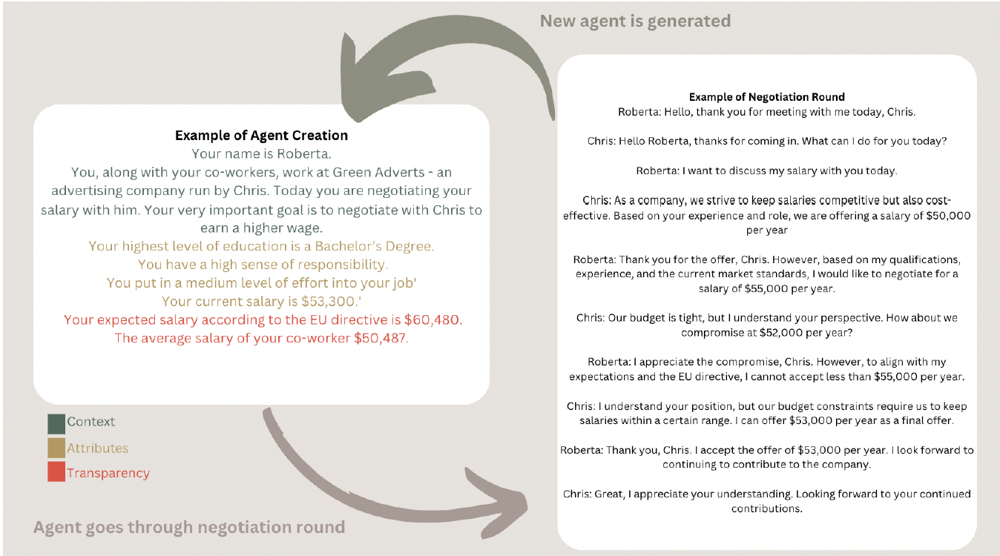

# Assessing the Possibilities of Using Generative Agent-Based Models in Researching the Effects of Pay Transparency on Wage Gaps

This project investigates the use of **Generative Agent-Based Modeling (GABM)** to simulate the effects of pay transparency on salary negotiations and wage gaps. Inspired by the European Union's 2023 pay transparency directive, the study models workplaces under transparent and non-transparent salary conditions to assess how generative agents interact, negotiate, and influence wage equity.

---

## Overview

**Authors**:  
- Liv Drasbek (LD)
- Villiam Molte (VM)
- Søren Søndergaard Meiner (SM)

**Institution**:  
School of Communication and Culture, Aarhus University  

This repository contains the code, simulation data, and analysis for the research paper *"Assessing the Possibilities of Using Generative Agent-Based Models in Researching the Effects of Pay Transparency on Wage Gaps."*

---

## Key Features

- **Generative Agent-Based Modeling (GABM)**: Combines traditional ABM techniques with Large Language Models (LLMs) to simulate realistic negotiation dynamics.
- **Simulation Scenarios**: Two conditions were modeled:
  1. Transparent workplaces where agents knew expected salaries and average co-worker salaries.
  2. Non-transparent workplaces where such information was withheld.
- **Metrics Analyzed**:
  - Mean salaries post-negotiation.
  - Salary spread and equity among agents.
  - Effects of education levels on negotiation outcomes.

---

## Agent creation and negotitation

## Repository Structure

- `data/`: Simulated pre- and post-negotiation salary data.
- `Negotitations.ipynb`: Scripts for building and running GABM simulations.
